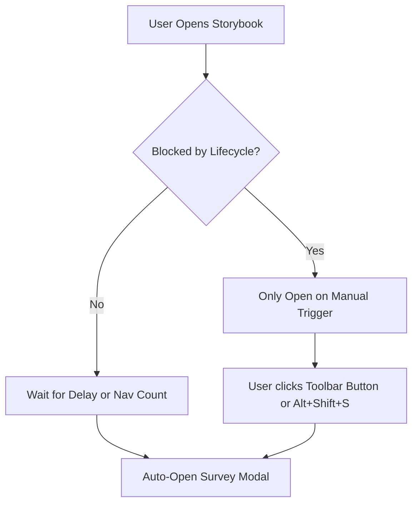
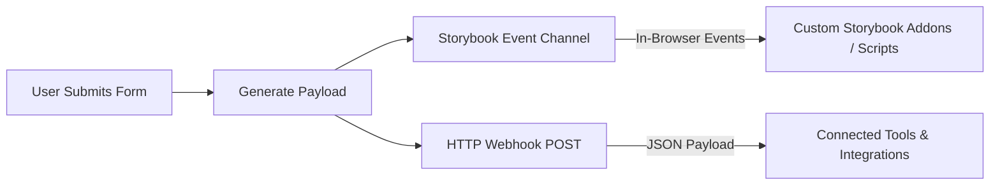
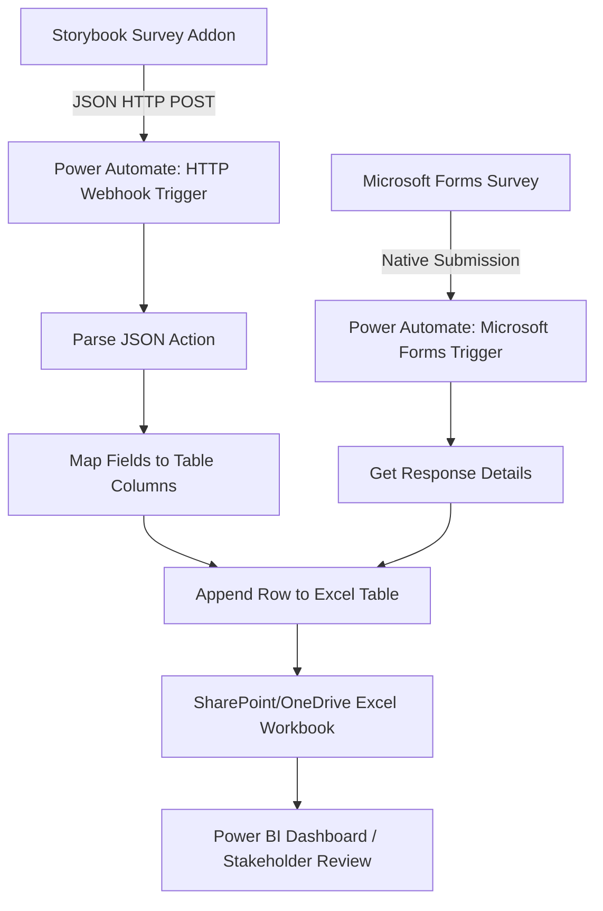

# Storybook Feedback Survey Addon - Design Decisions Record

This document outlines the architectural, technical, and user experience (UX) design decisions made during the development of the **Storybook Feedback Survey Addon**. It serves to validate the product idea, explain the directions chosen, and document key engineering trade-offs.

---

## 1. Monorepo Architecture

### Decision
Structure the repository as a monorepo with `npm workspaces`, isolating the addon source code (`addon/`) from the demonstration/testing environment (`demo/`).

### Rationale
- **Strict Boundaries**: Isolating the addon guarantees it is built as a self-contained NPM package without accidentally pulling in dependencies or assumptions from the local Storybook setup.
- **Zero-Copy Local Linking**: By listing `addon` and `demo` as workspaces, `npm install` automatically symlinks the local compiled addon into `demo/node_modules/`. Any build updates in `addon/` are immediately active in the demo.
- **Clean Development Loop**: Allows independent linting, type-checking, and compilation tasks while keeping them under a unified root repository.

---

## 2. Storybook 10 Manager Option Orchestration

### The Challenge
Storybook 10 (and preceding versions since 8) pre-bundles its Manager UI for speed. Historically, addons passed server-side options using a Webpack `DefinePlugin` inside a `preset.js` configuration. However, because the Storybook 10 Manager is pre-compiled, these build-time environment variables are ignored or bypassed, rendering traditional preset options brittle.

### Decision
Inject the dynamic survey schema and settings using **Storybook Parameters** in the preview context (`demo/.storybook/preview.ts`), and read them reactively on the manager side using `@storybook/manager-api`'s `useParameter` hook.

### Rationale
- **Storybook 10 Compliance**: Parameters are sent dynamically from the preview iframe to the manager via the channel, bypassing pre-bundling restrictions.
- **Reactive & Live**: Storybook parameters support hot-reloading. If a developer edits the survey questions in `preview.ts`, the toolbar button and modal update instantly without restarting the server.
- **Zero Boilerplate**: Developers configure the survey using standard Storybook syntax (in the global `parameters` object), matching the conventions of other first-party addons.

---

## 3. Data Isolation and Survey Versioning

### Decision
Prefix all storage keys in `localStorage` and `sessionStorage` with a configurable `surveyId` (e.g. `sb-survey-completed-${surveyId}`).

```typescript
const completedKey = `sb-survey-completed-${config.surveyId}`;
const skippedPermanentlyKey = `sb-survey-skipped-${config.surveyId}`;
const dismissedAtKey = `sb-survey-dismissed-at-${config.surveyId}`;
```

### Rationale
- **Rollout Autonomy**: When running multiple distinct surveys over time (e.g., rotating a "Documentation Survey" to a "Components Survey") or upgrading a survey to version 2 (`v2`), developers only need to increment the `surveyId`.
- **Automatic Reset**: Incrementing the `surveyId` isolates storage. Users who completed or skipped the previous survey (`v1`) will automatically see the new survey (`v2`) without manual cache-clearing.
- **Payload Segregation**: Database or webhook endpoints can easily filter and partition response payloads by the `surveyId` included in the submission payload.

---

## 4. Trigger & Lifecycle Management

### Decision
Provide an **"OR" trigger** matching mechanism for automatic popups (Time-Delay OR Story-Navigation Count), combined with robust automatic suppression, but keep **Manual Triggers** entirely unrestricted.



### Rationale
- **Automated Proactive Engagement**: Auto-popups catch passive users. A time delay (default 5s) handles static reading, while a story navigation counter (default 3 visits) captures active builders.
- **The Annoyance Block (Suppression)**: To maintain a premium, developer-friendly experience, auto-popups are completely suppressed if:
  - The survey is completed.
  - The survey is permanently skipped.
  - The survey has hit its impression cap (`maxImpressions`).
  - The survey has expired (`expiresAt` date has passed).
  - The snooze cool-down period (`coolDownDays`) is active.
  - The survey is globally disabled (`enabled: false`).
- **Unrestricted Manual Escape Hatch**: Regardless of suppression states (even if a user has completed or permanently skipped the survey), they can still open the survey manually at any time via the toolbar button or the **`Alt + Shift + S`** hotkey. This allows developers to submit updated feedback or verify changes.

---

## 5. Temporary Dismissal vs. Permanent Skip UI

### Decision
Provide distinct paths for temporary dismissal (Backdrop clicks, Close `X`, "Cancel") vs. permanent dismissal ("Don't show again"), with customized visual treatments and storage states.

| Dismissal Type | User Action | localStorage State | Auto-Popup State | Notification Dot State |
| :--- | :--- | :--- | :--- | :--- |
| **Temporary** | Backdrop click, `X` button, `Cancel` | Sets `dismissedAt` timestamp, increments `impressions` | Snoozed for `coolDownDays` or until `maxImpressions` reached | **Visible** (Indicates outstanding feedback) |
| **Permanent** | "Don't show again" button | Sets `skippedPermanently = true` | **Permanently suppressed** | **Hidden** (Respects user's opt-out) |

### Rationale
- **Reduced User Fatigue**: A "Don't show again" button is critical for developer tools. Once a user decides they do not want to participate, nagging them is a poor experience.
- **Visual Hygiene**: The permanent skip action must remove the red notification dot from the toolbar button to prevent continuous, distracting attention-grabbing.
- **Temporary Snoozing**: Temporary dismissals allow the survey to stay active in the background, snoozing it to respect active coding, but keeping the door open for feedback later.

---

## 6. Input Draft Persistence

### Decision
Sync all active form inputs (stars, textareas, check groups, radios) in real-time to `sessionStorage` under a `sb-survey-draft-${surveyId}` key, restoring them upon manual reopen, and cleaning them up only on a successful `submit` action.

### Rationale
- **Zero Friction**: Survey modals are frequently closed by accident (e.g. clicking outside on the backdrop or hitting `Esc`). Without draft persistence, losing complex comments or ratings is frustrating and leads to high drop-offs.
- **Session Boundaries**: Using `sessionStorage` ensures drafts persist across manual opens and story changes within the same tab, but clean up automatically when the tab is closed, preventing stale data from lingering in the user's browser.
- **Star Rating Storage Fix**: Explicitly synced the rating star integers into the unified draft object, resolving early bugs where the star-state was decoupled from text persistence.

---

## 7. Premium Aesthetics & Theme Integration

### Decision
Build modal interfaces and custom inputs utilizing Storybook's styling tokens (`@storybook/theming`) and CSS-in-JS (via `styled`), avoiding generic default styles.

- **Natively Responsive Theme**: Color values (`theme.background.content`, `theme.textColor`, `theme.appBorderColor`, `theme.color.secondary`) adapt beautifully between Storybook's light and dark modes.
- **Glassmorphism Backdrop**: The backdrop utilizes `backdrop-filter: blur(3px)` and a subtle `rgba(0, 0, 0, 0.5)` overlay to bring visual focus to the survey modal.
- **Micro-interactions**: Star rating buttons feature hover scaling (`scale(1.15)`) and active click feedback (`scale(0.95)`), making the voting interaction feel alive and fluid.
- **Visual Footer Alignment**: The "Don't show again" button is positioned on the far left of the modal footer, separating it from the action-primary "Submit Feedback" and "Cancel" buttons on the right to align with standard desktop interface layouts.

---

## 8. Feedback Results Communication and Integrations

### Decision
Provide a dual-channel communication architecture to transmit feedback data: a local **Storybook Event Channel** for real-time manager/preview orchestration and an external **HTTP Webhook Interface** to forward structured JSON payloads.



### Rationale
- **Zero-Dependency Direct Communication**: Emitters and listeners communicate over the Storybook event channel, enabling other installed addons to respond to survey completions immediately (e.g. tracking stats inside other tabs or toggling UI states).
- **Universal Payload Structure**: Standardized payload structure simplifies parsing:
  ```json
  {
    "surveyId": "doc-feedback-survey-v1",
    "timestamp": "2026-05-20T08:22:42.000Z",
    "responses": {
      "rating": 5,
      "clarity-radio": "Very Easy",
      "missing-content": ["Code Examples", "Accessibility Guides"],
      "additional-feedback": "Excellent docs!"
    }
  }
  ```
- **Frictionless Webhook Routing**: A plain JSON POST request makes it extremely simple to connect the addon to third-party tools and workflows:
  - **Collaborative Workspaces**: Send responses directly to a team chat channel (e.g. **Slack**, **Discord**, or **Microsoft Teams**) using their incoming webhook URLs.
  - **SaaS Integrations (No-Code/Low-Code)**: Forward to **Zapier**, **Make.com**, or **n8n** to automate actions like appending rows to a **Google Sheet**, creating records in **Airtable**, or adding customers to CRM dashboards.
  - **Project & Feedback Management**: Forward payloads to issue-tracking APIs (e.g., **Jira**, **Linear**, or **GitHub Issues**) to convert user complaints/suggestions directly into engineering tasks.
  - **Product Telemetry**: Route directly to ingestion servers or event logs of product analytics platforms (e.g., **PostHog**, **Mixpanel**, or **Segment**) for comprehensive user analysis.
  - **Self-Hosted APIs**: Route to a custom endpoint on your team's existing API or analytics server.

---

## 9. Enterprise Data Pipeline & Ingestion Strategy

In larger enterprise contexts, direct webhook connections must align with corporate security guidelines, data compliance frameworks (GDPR, HIPAA, SOC 2), and existing Microsoft 365 or Google Workspace investments. The addon addresses these concerns through a robust enterprise ingestion strategy.

### 1. Microsoft Ecosystem Pipeline (Excel Online & Forms Integration)

For companies utilizing Microsoft 365, **Microsoft Power Automate (Flow)** is the most common and robust approach to bridge the web-based Storybook addon with enterprise data storage (Excel and Microsoft Forms).



* **Automated Excel Data Ingestion:**
  * **Trigger:** Set up a Power Automate flow using the native **"When an HTTP Request is received"** trigger. This generates a unique, secure URL endpoints.
  * **Parsing:** The JSON schema of our payload is supplied to the trigger, making each survey answer a dynamic variable inside Power Automate.
  * **Storage:** The flow connects directly to the **"Excel Online (Business) - Add a row into a table"** action, writing new rows instantly into a company spreadsheet hosted on **SharePoint** or **OneDrive for Business**.
* **Unified Aggegation with Microsoft Forms:**
  * Microsoft Forms cannot accept direct inbound webhook posts. However, Microsoft Forms natively writes its data to a specific, connected Excel workbook inside SharePoint.
  * By routing the Storybook Addon's Power Automate flow to write to **that exact same spreadsheet file**, developers and product managers can merge in-app Storybook feedback and external standalone survey responses into a single, unified source of truth.

### 2. Enterprise-Grade Security and Compliance

To comply with corporate security standards, the addon's design establishes clear guidelines for authentication, network topologies, and privacy:

* **Authorization and Custom Webhook Headers:**
  * **The Decision:** Extend the `SurveyConfig` parameters to support optional, custom HTTP headers (e.g. `webhookHeaders`).
  * **The Rationale:** This allows security teams to inject authentication credentials (e.g., `Authorization: Bearer <token>`, `X-API-KEY`, or signed tokens) to verify that submissions coming into corporate databases or Power Automate flows are authentic and secure.
* **PII Sanitization and Data Governance (GDPR / SOC 2):**
  * **The Decision:** Keep surveys fully anonymous by default and persist drafts solely inside browser `sessionStorage`.
  * **The Rationale:** Storing working drafts inside transient `sessionStorage` instead of `localStorage` ensures that no user input lingers on shared machines after a tab is closed. Surveys should be designed with explicit notices if email or user IDs are requested, protecting corporate GDPR status.
* **Corporate Firewall & Network Proxy Compliance:**
  * **The Decision:** Execute all webhooks using the native browser `fetch` API inside the client iframe.
  * **The Rationale:** Leveraging standard browser-level requests ensures that the corporate network's custom certificate authorities (CAs), VPN tunnels, proxies, and firewall configurations are automatically inherited, avoiding network blockages common with custom Node-level clients.
* **Zero Hardcoding & Secret Hygiene via Environment Variables:**
  * **The Decision:** Mandate that all sensitive configurations (like the `webhookUrl` and authentication headers) are **never** hardcoded into version-controlled source files (such as `preview.ts`). Instead, they must be resolved dynamically at build time using Storybook-compliant environment variables.
  * **The Rationale:** Developers inject these variables during the compilation/bundling phase using Storybook's environment system (prefixed with `STORYBOOK_`, e.g., `process.env.STORYBOOK_FEEDBACK_WEBHOOK_URL`) backed by `.env` files or CI/CD runner secrets. This keeps tokens out of public/shared Git repositories and permits environmental promotion (e.g., Dev, Staging, and Production Storybooks targeting different webhooks and security tokens without code changes).


